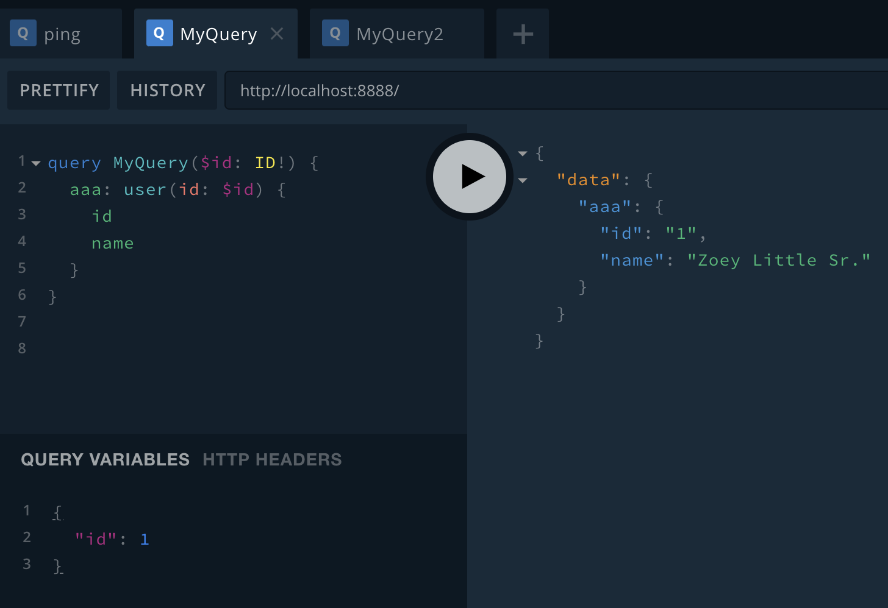
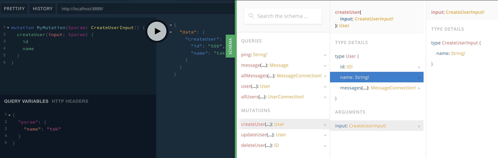

# React Apollo로 GraphQL 적용하기

- [강의자료](./doc.pdf)
- [sample project](https://github.com/merongmerongmerong/innolab)

## Schema
- 제공할 데이터를 묘사합니다
- 서버에서 사용

## Query
- 요청할 데이터를 사용
- 클ㄹ이언트에서 사용

---

```
$ npm start # localhost:8888
# 플레이그라운드
```

- user
  - id, name 이라는 데이터를 받고 싶다.
```
# Full query
query MyQuery {
    user(id: "0") {
        id
        name
    }
}

# query 이름 생략
query {
    user(id: "0") {
        id
        name
    }
}

{
    user(id: "0") {
        id
        name
    }
}

# alias 가능
{
    aaa: user(id: "0") {
        id
        name
    }
}

```

- query에 변수 넣기
  - ID! : Schema 의 타입
  - $unique_id : 변수명
```
query MyQuery($unique_id: ID!) {
  aaa: user(id: $unique_id) {
    id
    name
  }
}

# query variable
{
  "unique_id": 2
}
```

- 왼쪽하단에 query variable에 변수 입력


---

## GraphQL
- Mutation: 데이터 쓰기
- Query: 데이터 읽기

### Mutations

#### Query
```
mutation MyMutation($param: CreateUserInput!) {
  createUser(input: $param) {
    id
    name
  }
}
```

#### Variable
```
{
  "param": {
    "name": "tak"
  }
}
```


---

### 여러 depth의 query

- author는 User! 타입을 가지고 있음
```
{
  message(id: "7") {
    id
    payload
    createdAt
    author {
      id
      name
    }
  } 
}
```

---

### All USer

- 아래의 ```first``` param은 가져올 갯수를 정함(ipp 같은)
- cursor는 다음 query ????
    - ```after```에 사용해야할듯

```
query MyAllUsers {
  allUsers(first: 10) {
    totalCount
    edges {
      cursor
      node {
        id
        name
      }
    }
  }
}
```

- 500번 다음의 3명의 user를 불러옴(499번부터 3명 가져옴)
```
query MyAllUsers {
  allUsers(first: 3, after: "500") {
    totalCount
    edges {
      cursor
      node {
        id
        name
      }
    }
  }
}
```

- 사실 위의 after는 ```pageInfo```의 ```endCursor```를 통해 가져올 수 있음
```
query MyAllUsers {
  allUsers(first: 5, after: "10") {
    totalCount
    pageInfo {
      endCursor
      hasNextPage
    }
    edges {
      cursor
      node {
        id
        name
      }
    }
  }
}
```


----


# React + Apollo

```
$ create-react-app apollo-prj --typescript
```

- innolab 프로젝트 참조
